# Maxime Lacoste · `maxyull`

**Full-stack developer, freelance.** I build, fix, and ship web apps and SaaS — solo, and fast.

My focus: taking projects (often started with an AI builder like Lovable or Bolt) from demo to production — the part where real Row Level Security, auth, billing and monitoring decide whether an app survives real users.

### What I'm building

**[Occulta](https://occulta.fr)** — a SaaS that strips personal data (PII) *before* anything is sent to an AI. Built for lawyers and confidentiality-bound professions (GDPR, EU AI Act). Next.js · Supabase · Stripe, multi-provider LLM.

**[Black Desert Idle](https://github.com/maxyull/black-desert-idle)** — an idle game I built and run solo. ~945 commits.

- 34-page admin panel, public leaderboard, patch notes with karma voting
- Supabase for real: RLS, Edge Functions, pg_cron
- Bilingual FR/EN (i18next), PWA
- CI/CD with GitHub Actions + Playwright tests

### Stack

`Next.js` · `React` · `TypeScript` · `Tailwind` · `Supabase` / `PostgreSQL` · `Stripe` · `Node.js` · `Python`

### Products

Production-ready boilerplates and tools for developers → **[maxyull.gumroad.com](https://maxyull.gumroad.com)**
Next.js + Supabase + Stripe bases, ready to ship (SaaS Starter, LaunchProof, The Developer's AI Prompt Pack).

### Activity

<picture>
  <source media="(prefers-color-scheme: dark)" srcset="./cards/stats-dark.svg">
  
</picture>
<picture>
  <source media="(prefers-color-scheme: dark)" srcset="./cards/langs-dark.svg">
  
</picture>

<picture>
  <source media="(prefers-color-scheme: dark)" srcset="./cards/streak-dark.svg">
  
</picture>

<picture>
  <source media="(prefers-color-scheme: dark)" srcset="./cards/graph-dark.svg">
  
</picture>

### Reach me

**Contact** — [LinkedIn](https://www.linkedin.com/in/maxyull) · [Instagram](https://www.instagram.com/maxyull/)

**Content** — [YouTube](https://www.youtube.com/@Maxyull) · [TikTok](https://www.tiktok.com/@maxyull) · [X](https://x.com/Maxyull_) · [Threads](https://www.threads.net/@maxyull) · [Reddit](https://www.reddit.com/user/Maxyull)

**Shop** — [Gumroad](https://maxyull.gumroad.com) · [Fiverr](https://www.fiverr.com/maxyull) · [ComeUp](https://comeup.com/@maxyull) · [Product Hunt](https://www.producthunt.com/@maxyull)

Got an app to unblock or build? Message me.
